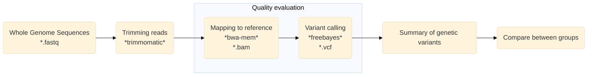

## Workflow

```mermaid
%%{init: {'theme':'base'}}%%
graph LR
    A("Whole Genome Sequences
    *.fastq") --> B("Trimming reads
    *trimmomatic*")
     B --> C("Mapping to reference
     *bwa-mem*
      *.bam")
    subgraph "Quality evaluation"
    C -->D("Variant calling
     *freebayes*
     *.vcf")
     end
     D --> G("Summary of genetic variants")
     G--> H("Compare between groups")
```
